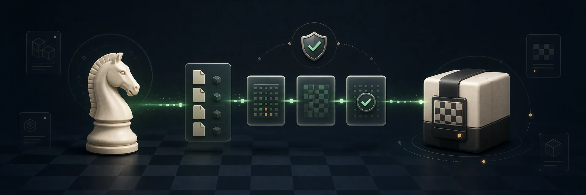

# UCI Grabber

UCI Grabber downloads and assembles ready-to-use UCI chess engine packages.
Its curated catalog currently provides Maia3 5M, 23M, and 79M for
[FishEye](https://github.com/EnchiladaBoy/FishEye) or any chess GUI that accepts
a zero-argument UCI engine executable.

UCI Grabber is a separate application: it never edits FishEye settings or
approves an engine on FishEye's behalf. FishEye integration is optional; every
installed engine can also be copied or revealed and added to another GUI.



## Install

Download the application archive for your system from the
[latest release](https://github.com/EnchiladaBoy/UCI-Grabber/releases/latest):

| System | Application archive | Start UCI Grabber with |
| --- | --- | --- |
| Windows x86-64 | `uci-grabber-windows-x86_64.zip` | `UCI-Grabber.exe` |
| macOS Apple silicon | `UCI-Grabber-macos-aarch64.app.zip` | `UCI Grabber.app` |
| Linux x86-64 | `uci-grabber-linux-x86_64.tar.gz` | `uci-grabber` |
| Linux ARM64 | `uci-grabber-linux-aarch64.tar.gz` | `uci-grabber` |

The macOS build requires macOS 12.3 or newer. Linux builds require glibc 2.35
or newer, as provided by Ubuntu 22.04 LTS and equivalent distributions. Assets
named `uci-grabber-maia3-launcher-*` are internal components and are not
standalone applications.

1. Extract the complete archive to a writable location and open UCI Grabber.
2. Choose a Maia3 model, then select **Install** or
   **Install & open in FishEye**.
3. When installation finishes, use the engine directly in FishEye or select
   **Copy engine path** / **Open package folder** for another chess GUI.

There is no system installer or administrator setup. Keep the extracted
application folder together: releases store settings and installed engines in
`UCI-Grabber-Data/` beside the application so the complete folder remains
portable.

FishEye integration requires FishEye 1.8.0 or newer. Version 0.1.0 stored its
state in the operating system's application-data directory; upgrading does not
delete that legacy state. Advanced users can inspect it with the CLI's
`--data-dir` option and re-import any custom recipes they still need.

## Security

Release archives are not Authenticode-signed, Apple Developer ID-signed, or
notarized, so Windows or macOS may warn on first launch. Verify the archive
against the release's `SHA256SUMS` file and confirm that it came from this
repository.

For curated installs, UCI Grabber downloads Maia3, portable Python,
dependencies, and the selected checkpoint directly from their upstream
publishers. It checks every declared size and SHA-256 before assembling and
testing the engine locally. Those third-party files are not republished in UCI
Grabber release archives.

Custom recipes are data-only, but the engine they download is still native
code. Its UCI test runs with your account permissions and no operating-system
sandbox, so approve a custom recipe only when you trust its publisher and exact
artifact hashes. See the [security model](docs/SECURITY.md) for the full trust
boundaries and extraction limits.

## Command line

The GUI covers the normal install workflow. The CLI also supports scripting,
custom recipes, integrity checks, FishEye handoff, and removal:

```console
uci-grabber list
uci-grabber list --refresh
uci-grabber import ./engine-recipe.json
uci-grabber install maia3 --model maia3-5m
uci-grabber status
uci-grabber open-in-fisheye INSTALL_ID
uci-grabber remove INSTALL_ID --confirm
```

Copy `INSTALL_ID` from `status`. Portable commands are `./uci-grabber` on
Linux, `.\uci-grabber-cli.exe` on Windows, and
`./UCI\ Grabber.app/Contents/MacOS/uci-grabber` on macOS. Pass `--data-dir PATH`
before a subcommand to inspect a specific data directory. Installing an
imported recipe also requires `--approve-unreviewed`; use `status --repair`
only to clean interrupted staging and repair activated-generation records.

## Build from source

Rust 1.92 or newer is required.

```console
cargo run --release
```

A source build intentionally uses the signed, empty bootstrap catalog because
the curated Maia3 catalog depends on platform launchers built during release
CI. Use an official release archive to install from the curated catalog; source
builds can still import custom recipes.

Core checks are:

```console
cargo fmt --all --check
cargo clippy --workspace --all-targets --all-features --locked -- -D warnings
cargo test --workspace --all-targets --all-features --locked
python3 -m unittest discover -s catalog/tests -v
```

See the [development guide](docs/DEVELOPMENT.md) for Linux build dependencies
and the complete local CI check set.

## Documentation

- [Development guide](docs/DEVELOPMENT.md)
- [Custom recipe format](docs/RECIPE_FORMAT.md)
- [Catalog and recipe contract](catalog/README.md)
- [Security model](docs/SECURITY.md)
- [Release process](docs/RELEASING.md)
- [Maia3 packaging notes](packaging/maia3/README.md)

## License

UCI Grabber is licensed under [Apache-2.0](LICENSE). Engines, runtimes,
dependencies, and models retain their own licenses; review the metadata shown
before installation.
